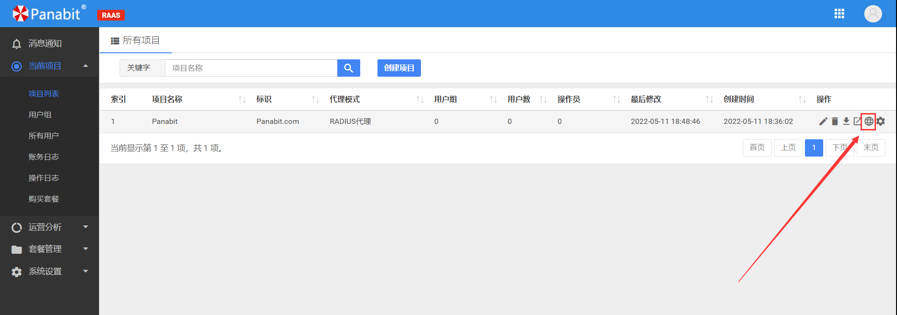
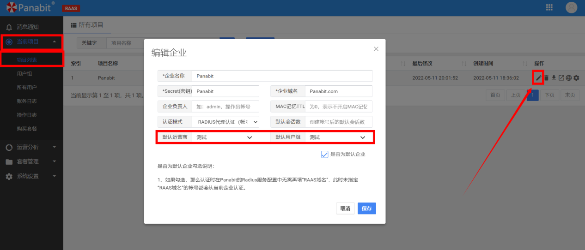
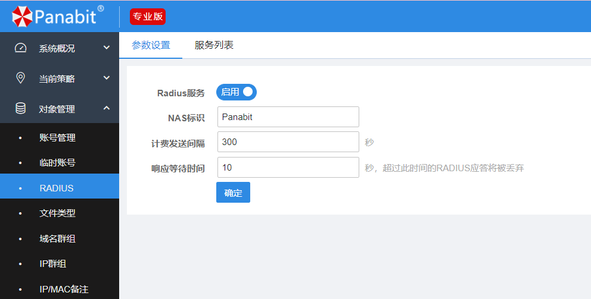
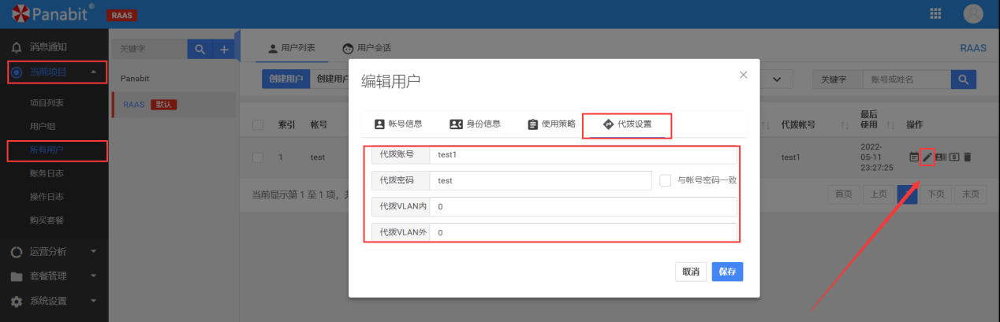
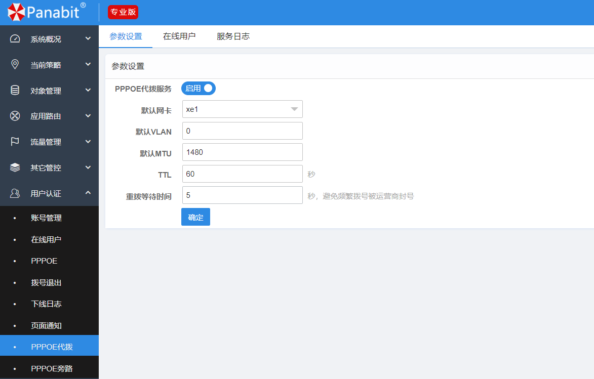

<h1 align="center">
  
   
  Panabit 智能应用网关
</h1>
<h4 align="center">出口一体化智能应用网关</h4>

  <a href="README.md" style="color: #007bff; text-decoration: none; font-weight: bold;">English</a> | 中文

---

# BRAS 使用（支持pppoe代理与代拨）

## 📌 目录
- 📖 [BRAS 概述](#brass-概述)
- ⚙️ [RAAS 功能](#raas-功能)
- 🔄 [RAAS 代理](#raas-代理)
  - 📝 [RAAS 代理配置](#raas-代理配置)
- 🔄 [RAAS 代理代拨](#raas-代理代拨)
- 🌐 [逻辑拓扑](#逻辑拓扑)
- 💻 [相关命令与管理](#相关命令与管理)
- ❓ [常见问题 FAQ](#常见问题-faq)

## 📖 BRAS 概述
BRAS（Broadband Remote Access Server，宽带远程接入服务器）是用于用户接入的网络设备，它能够提供对宽带用户的管理、认证、计费和访问控制等功能。本部分将介绍 BRAS 的基本功能和作用。

## ⚙️ RAAS 服务器
RAAS（Remote Access Authentication Server，远程访问认证服务器）是 BRAS 支持的一种功能，它允许进行 RAAS 代理与代理代拨配置。

## 🔄 Pppoe代理
Pppoe 代理为一种配置，允许 BRAS 在连接时充当代理，来进行远程认证。通过该功能，BRAS 能够支持外部 RADIUS 服务器认证，而无需直接处理认证过程。

### 应用场景
- **外包拨号/VPN 认证**：RAAS 代理通过 RADIUS 协议提供认证服务，避免直接暴露 RADIUS 服务器给公网，提高系统的安全性。
- **大规模 RADIUS 代理**：RAAS 代理能够管理多个 RADIUS 服务器，提升负载均衡能力，在面对大规模用户接入时能更高效地处理认证请求。

### 应用场景
- **Wi-Fi 热点、企业 VPN 认证**：适用于需要集中认证的接入场景，能够减少设备的配置和管理负担。
- **自动注册并动态绑定拨号信息**：通过自动化流程，减少人工干预，实现更加高效的系统运维。

## 🌐 逻辑拓扑
在 BRAS 使用中，逻辑拓扑展示了设备之间如何通过 RAAS 代理与代理代拨进行通信。

 
---

## 配置说明

### RAAS 代理配置

#### ① 创建项目
- 进入 **【当前项目】 > 【项目列表】**
- **认证模式选择**：`RADIUS 代理认证`
 

#### ② 添加 RADIUS 服务器
- 进入 **【运营商接入管理】**  
- 配置 **RADIUS 服务器信息**：
 

#### ③ 创建用户组
- 进入 **【当前项目】 > 【用户组】**
- **注册用户组**，RAAS 代理会 **自动归类认证用户**
 

#### ④ 修改项目设置
- 进入 **【当前项目】 > 【项目列表】**
- **选择默认运营商 & 默认用户组**
 

#### ⑤ 对接 BRAS
- 进入 **【对象管理】 > 【RADIUS】**
- **添加 RAAS 设备**，并在 **PPPoE/Web 认证** 中调用
 
 

---

### RAAS 代理代拨配置

#### ① 启用 RAAS 代理

#### ② 绑定代拨信息
- 访问 `http://RAAS的IP` 进入 **自助服务后台**，绑定拨号信息

#### ③ BRAS 代拨配置
- 进入 **【用户认证】 > 【PPPoE 代拨】**
- 在 **参数设置** 中，启用 **代拨功能**：

---

## 相关链接
🔗 访问官网：[www.panabit.com](https://www.panabit.com/)  
🔗 访问论坛：[bbs.panabit.com](https://bbs.panabit.com/)  

📧 技术支持邮箱：support@panabit.com

📞 联系我们，获取更详细的解决方案！

