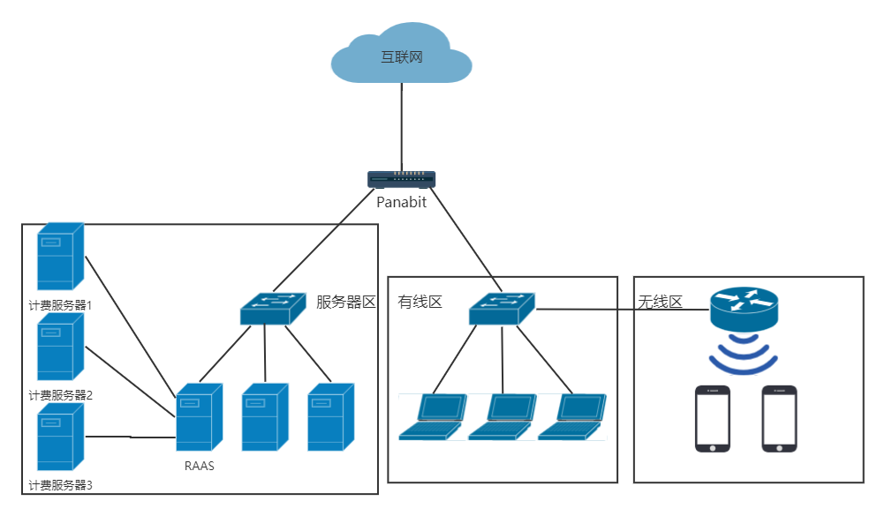
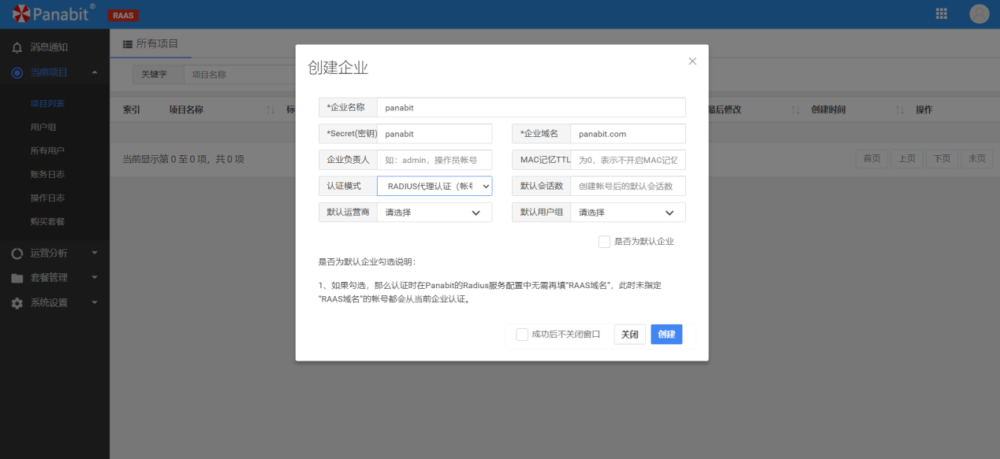
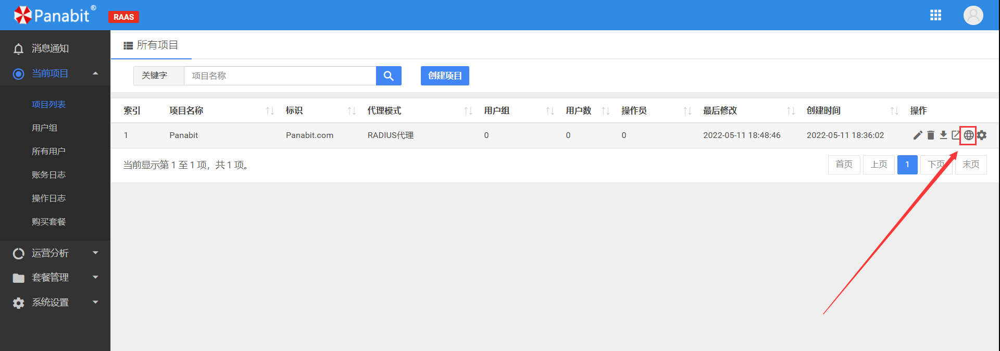
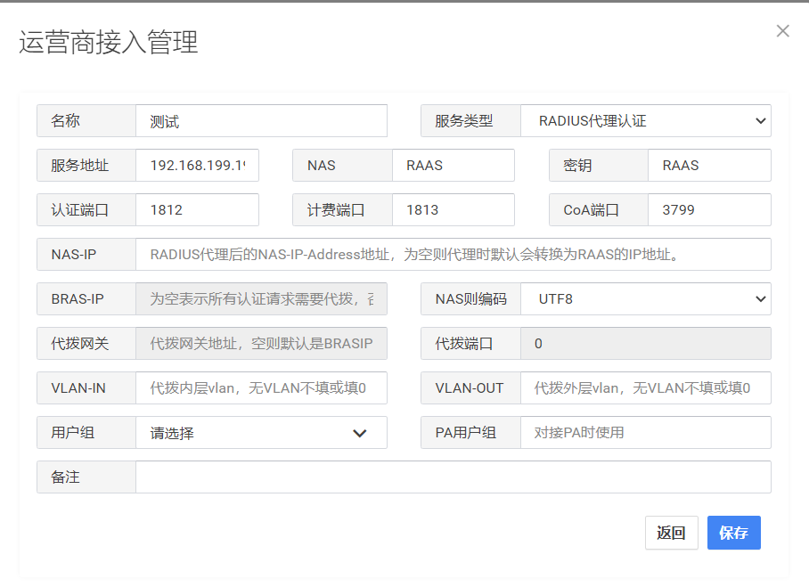
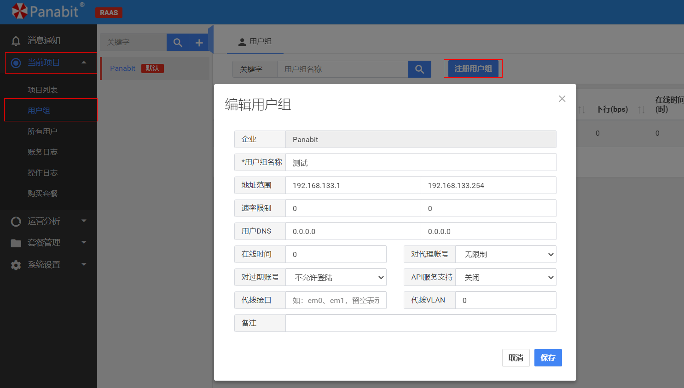
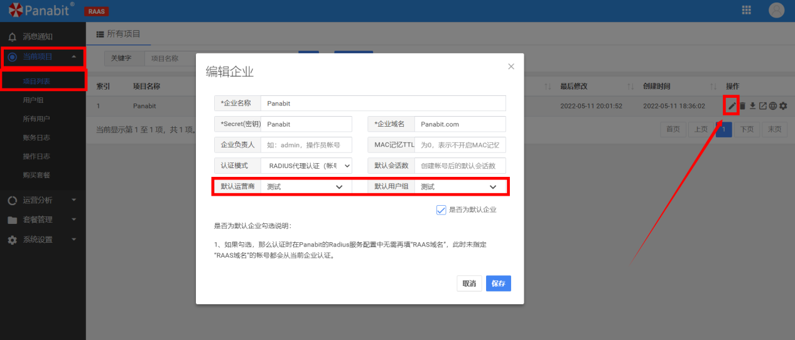
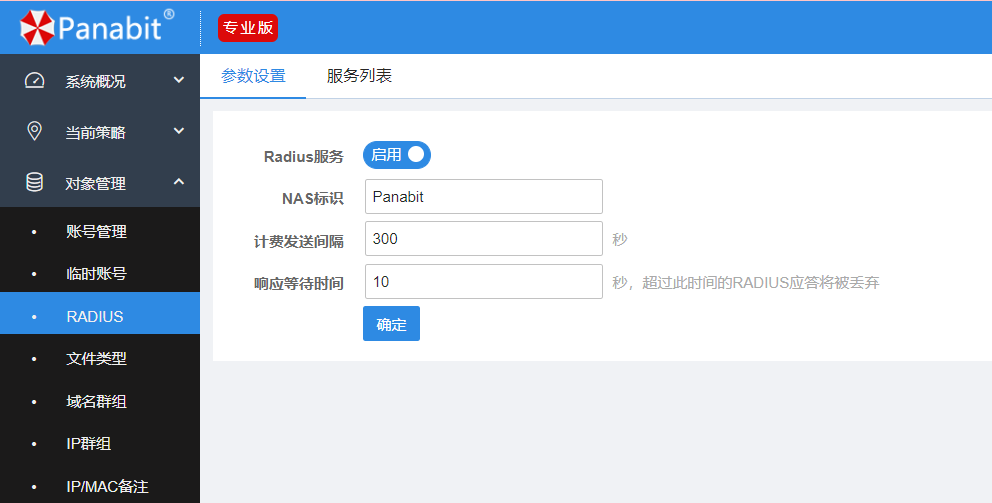
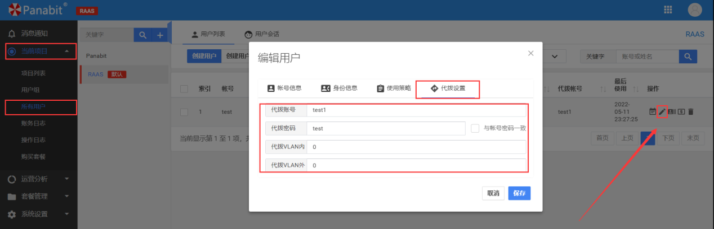
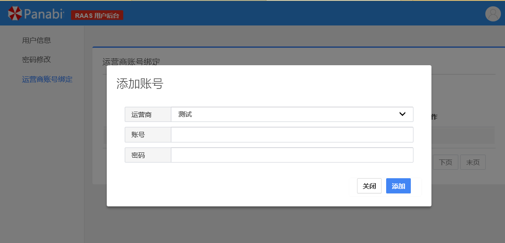
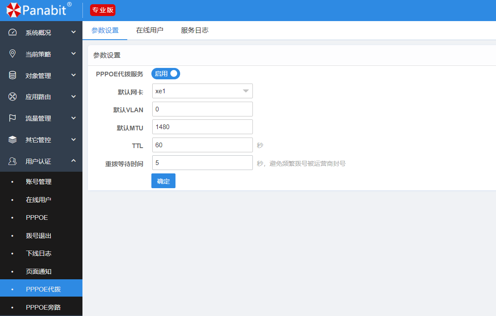

<h1 align="center">
  
   
  Panabit Intelligent Application Gateway
</h1>
<h4 align="center">Integrated Outbound Intelligent Application Gateway</h4>

  <a href="README.md" style="color: #007bff; text-decoration: none; font-weight: bold;">中文</a> | English

---

# BRAS Usage (Supports RAAS Proxy & Proxy Dialing)

## 📌 Table of Contents
- 📖 [BRAS Overview](#bras-overview)
- ⚙️ [RAAS Features](#raas-features)
- 🔄 [RAAS Proxy](#raas-proxy)
  - 📝 [RAAS Proxy Configuration](#raas-proxy-configuration)
- 🔄 [RAAS Proxy Dialing](#raas-proxy-dialing)
- 🌐 [Logical Topology](#logical-topology)
- 💻 [Commands & Management](#commands--management)
- ❓ [FAQ](#faq)

## 📖 BRAS Overview
BRAS (Broadband Remote Access Server) is a network device for user access, offering management, authentication, billing, and access control for broadband users. This section outlines its basic functions and roles.

## ⚙️ RAAS Features
RAAS (Remote Access Authentication Server) is a BRAS-supported feature that enables configuration for both RAAS Proxy and Proxy Dialing.

## 🔄 RAAS Proxy
RAAS Proxy lets BRAS act as a proxy during connections to perform remote authentication. It supports external RADIUS server authentication without directly managing the process.

### Use Cases
- **Outsourced Dialing/VPN Authentication**: Uses the RADIUS protocol to authenticate, shielding the RADIUS server from direct public exposure for enhanced security.
- **Large-Scale RADIUS Proxy**: Manages multiple RADIUS servers to improve load balancing and efficiently handle authentication for large user bases.

## 🔄 RAAS Proxy Dialing
RAAS Proxy Dialing allows a proxy server to initiate dialing requests on behalf of users, enabling network access. This is ideal for scenarios like Wi-Fi hotspots and enterprise VPNs, reducing operational costs.

### Use Cases
- **Wi-Fi Hotspot & Enterprise VPN Authentication**: Centralized authentication reduces configuration and management efforts.
- **Automatic Registration & Dynamic Dialing Binding**: Automates processes to minimize manual intervention and boost system efficiency.

## 🌐 Logical Topology
The logical topology shows how devices communicate via RAAS Proxy and Proxy Dialing in a BRAS deployment.

---

## Configuration Instructions

### RAAS Proxy Configuration

#### ① Create Project
- Navigate to **Current Project > Project List**
- **Select Authentication Mode**: `RADIUS Proxy Authentication`
  
  

#### ② Add RADIUS Server
- Go to **Operator Access Management**
- Configure **RADIUS Server Information**:
  
  

#### ③ Create User Group
- Go to **Current Project > User Group**
- **Register a User Group**; RAAS Proxy will **automatically classify authenticated users**
  
  

#### ④ Modify Project Settings
- Navigate to **Current Project > Project List**
- **Select the default operator & user group**
  
  

#### ⑤ Integrate with BRAS
- Go to **Object Management > RADIUS**
- **Add RAAS Device** and invoke it under **PPPoE/Web Authentication**
  
  
  
  

---

### RAAS Proxy Dialing Configuration

#### ① Enable RAAS Proxy
  
  

#### ② Bind Dialing Information
- Access `http://[RAAS_IP]` to enter the **Self-Service Portal** and bind dialing info
  
  

#### ③ BRAS Dialing Configuration
- Go to **User Authentication > PPPoE Dialing**
- In **Parameter Settings**, enable the **Dialing Function**
  
  

---

## Related Links
🔗 Official Website: [www.panabit.com](https://www.panabit.com/)  
🔗 Forum: [bbs.panabit.com](https://bbs.panabit.com/)  

📧 Technical Support: support@panabit.com

📞 Contact us for more detailed solutions!

